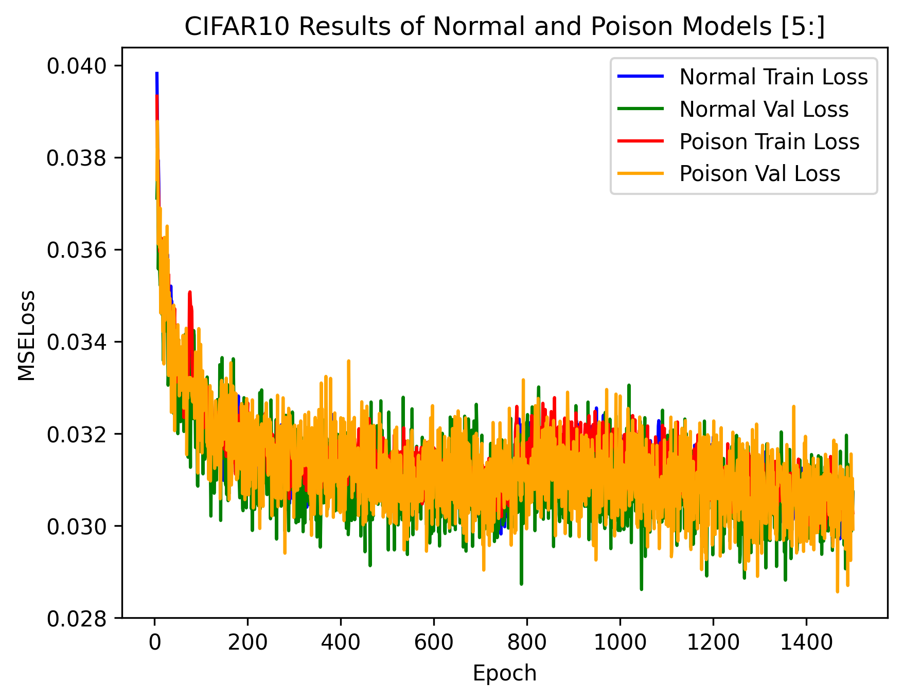
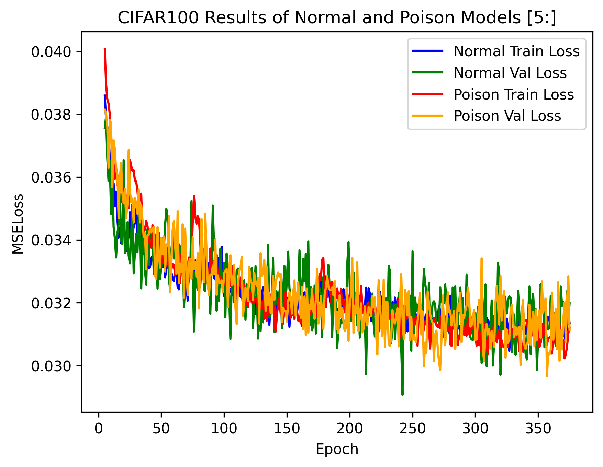
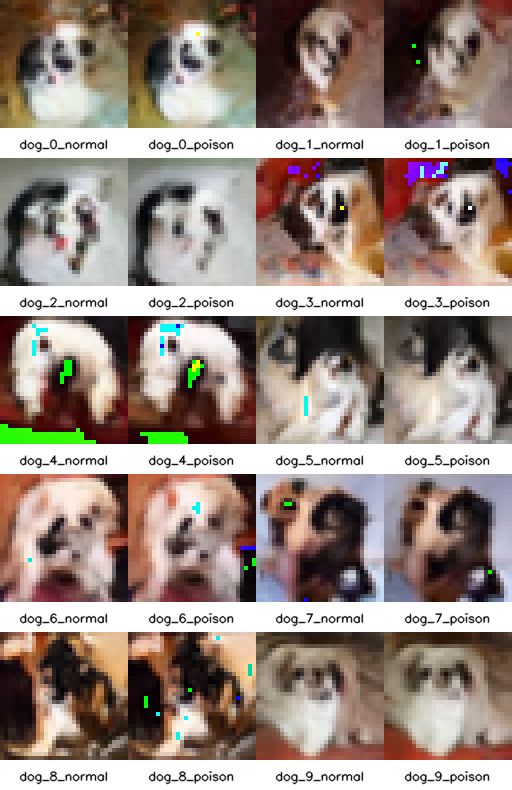
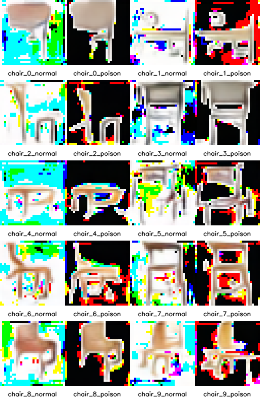
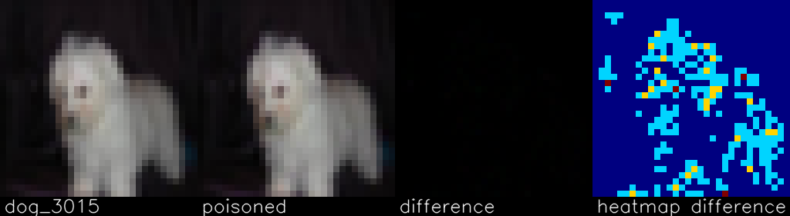
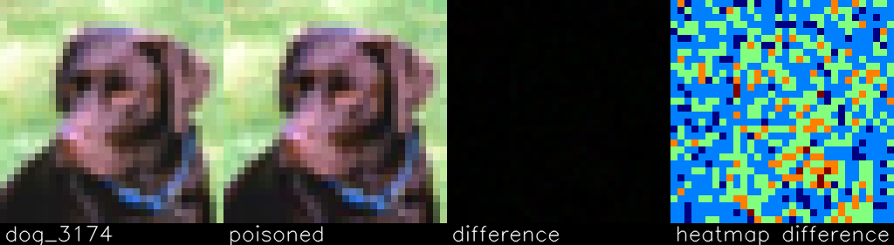
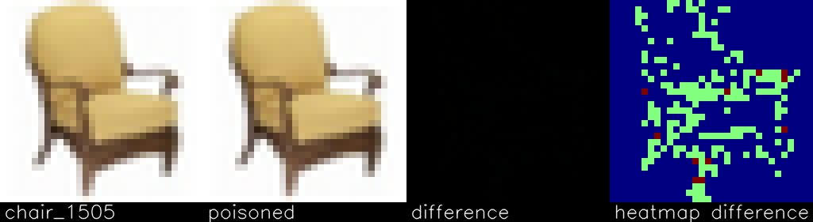
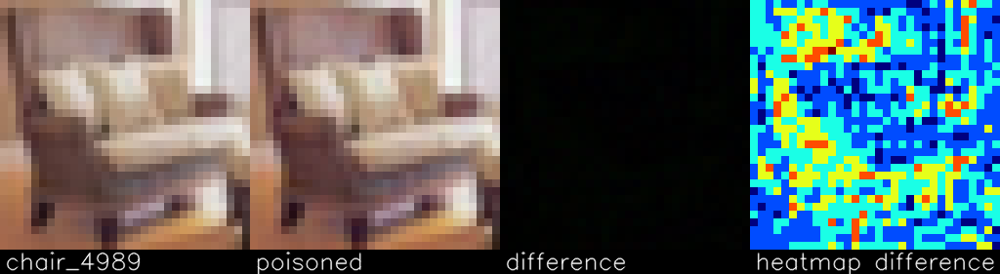
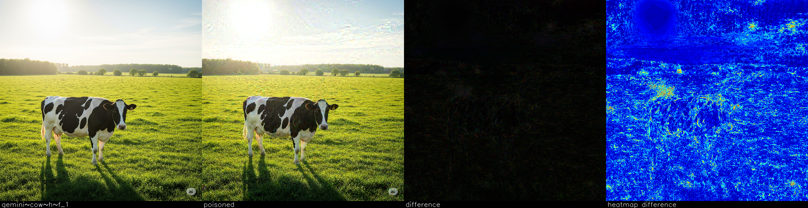

<h1 align="center">nightshade-poison-testing</h1>

<p align="center">
  This project is Yero's testing on the effectiveness of Nightshade poisoning in training diffusion models. 
</p>

## About
Generative AI is becoming more popular and easier to use as technological capabilities increases. These models requires large amount of data, the more clean data the better the model is able to generate the output. There are different types of generative models, the one used in this repository is diffusion. 
<br><br>
>... Nightshade is an offensive tool that artists can use as a group to disrupt models that scrape their images without consent (thus protecting all artists against these models). (Computer Science UChicago., n.d.)

The [Nightshade program tool is freely available](https://nightshade.cs.uchicago.edu/downloads.html) to use by anyone, given with correct supporting platforms (OS and GPU). The paper [<i>Nightshade: Prompt-Specific Poisoning Attacks on Text-to-Image Generative Models</i>](https://arxiv.org/abs/2310.13828) goes into the detail of the Nightshade's effectiviness of disrupting a few generative ai models during training. 
<br><br>
Online discussion on how effective Nightshade poisoning is in the wild are mixed results, with some claiming it works flawlessly and others say it has no impact. With this in mind, I decided to test how effective Nightshade is with a toy u-net diffusion model. 

## Table of Contents
 - [About](#about)
 - [Table Of Contents](#table-of-contents)
 - [YouTube Video](#youtube-video)
 - [Model Setup](#model-setup)
 - [Datasets Used and Results](#datasets-used-and-results)
 - [Results Explanation](#results-explanation)
 - [The Train and Validation Loss for CIFAR10](#the-train-and-validation-loss-for-cifar10)
 - [The Train and Validation Loss for CIFAR100](#the-train-and-validation-loss-for-cifar100)
 - [CIFAR10 Dog Inferenced Normal and Posion Images Comparison](#cifar10-dog-inferenced-normal-and-poison-images-comparison)
 - [CIFAR100 Chair Inferenced Normal and Posion Images Comparison](#cifar100-chair-inferenced-normal-and-poison-images-comparison)
 - [Possible Issues](#possible-issues)
 - [How To Run](#how-to-run)
 - [Resources](#resources)
 - [References](#references)
 - [Copyright Information](#copyright-information)


## YouTube Video
Here is a video showcasing the visualizations of the examples below:
<br>
[Cold Diffusion Variant Models](https://youtu.be/JdRaWuKZdo8)

## Model Setup
- U-Net Diffusion Model
- CIFAR10 and CIFAR100 Datasets
- Linear Beta Scheduler
- DDPM Approach
- 1,000 Timesteps
- High intensity and Faster render quality (Nightshade program settings)

## Datasets Used and Results
| <p align="center">Dataset</p>   | <p align="center">Class Poisoned</p>  | <p align="center">Image Size</p>  | <p align="center">Class Sparsity</p>  | <p align="center">% Class Images Poisoned</p>  | <p align="center">Epoch/Steps Trained To</p>  | <p align="center">Model Disrupted?</p>  |
| ------------- | ------------- | ------------- | ------------- | ------------- | ------------- | ------------- |
| <p align="center">CIFAR10</p>   | <p align="center">Dog</p>  | <p align="center">32x32</p>  | <p align="center">10%</p>  | <p align="center">10%</p> | <p align="center">1500/586,891</p> | <p align="center">:x:</p> |
| <p align="center">CIFAR100</p>   | <p align="center">Chair</p>   | <p align="center">32x32</p>  | <p align="center">1%</p>  | <p align="center">10%</p> | <p align="center">375/147,016</p> | <p align="center">:x:</p> |

## Results Explanation
Nightshade poisoning did not disrupt either CIFAR10 or CIFAR100 model training. The loss trends of the normal and poisoned models are similar. The inferenced images of the normal and poisoned models are similar - meaning the poisoned model did not diverage from the learnt noise it predicted similarly in the normal model. Quality of the inferenced images are subpar but does not show the poisoned model inferenced images any transformations into a different class.

## The Train and Validation Loss for CIFAR10


## The Train and Validation Loss for CIFAR100


## CIFAR10 Dog Inferenced Normal and Poison Images Comparison


## CIFAR100 Chair Inferenced Normal and Poison Images Comparison


## Possible Issues
Nightshade poisoning relies on high sparisty of a concept in a massive dataset. CIFAR10 and CIFAR100 are both small datasets comprised of 60,000 images (50,000 for training and 10,000 for validation). CIFAR100 has the lowest current used class sparisty of 1%, much lower than the sparsities somewhat reported in the Nightshade paper. Even if 10% of the class images were poisoned, which is fives times more than the trendline of 2% "needed to acheive a 90% attack success" in Figure 13 of the paper, the models trained were not disrupted. A bigger dataset comprising of higher sparsity may be needed to for Nightshade to be effective. But does this mean there is a minimum level of sparsity required in a dataset for the training model to be disrupted by Nightshade poison? This does not take into account class and weight balancing among other technical options.

The images size could have a role in how effective Nightshade poisoning is. CIFAR10 and CIFAR100 both have 3x32x32 images. Tiny images compared to what top generative models use for training. Below are some examples of the Nightshade poisoning (settings on High intensity and Faster render quality, unless otherwise stated, on Nighshade program). Images have been resized to be bigger visually.
<br>

<br>

<br>

<br>

<br>
At this small resolution, Nighshade poison barely made any visible change of the original image. Using a heatmap to rescale the difference to highlight what pixels were altered, you can see what the Nightshade program targeted to poison. The background does sometime gets altered by the Nightshade program. In the Nightshade program are a possible of 12 poison combinations. The poisoned datasets used the combination stated above. 
<br>
<br>
I decided to try Nightshade poison on a bigger and higher quality image to see the impact it has on both image quality and amount of poison added. The image below is AI generated using Google Gemini.

The above image used the High intensity and Faster render quality settings in the Nightshade program.
<br>

The above image used the High intensity and Slowest render quality settings in the Nightshade program.
<br>
<br>
These ai generated images has been resized down (to fit into github maximum upload limit) and may not show the extent of visible Nightshade poison that was applied. I recommend you to download the images to see the altered changes as they are quite visible. These larger higher quality ai generated images shows the difference between the original and poisoned versions. The heatmap gives insight of what the Nightshade program is targetting to poison. It seems to be targetting the outlines of the image as you can still see the cow, the cow's shadow, the forest, and even where the sun's position is.  
<br>
> Nightshade works similarly as Glaze, but instead of a defense against style mimicry, it is designed as an offense tool to distort feature representations inside generative AI image models. Like Glaze, Nightshade is computed as a multi-objective optimization that minimizes visible changes to the original image. While human eyes see a shaded image that is largely unchanged from the original, the AI model sees a dramatically different composition in the image. For example, human eyes might see a shaded image of a cow in a green field largely unchanged, but an AI model might see a large leather purse lying in the grass. Trained on a sufficient number of shaded images that include a cow, a model will become increasingly convinced cows have nice brown leathery handles and smooth side pockets with a zipper, and perhaps a lovely brand logo.(Computer Science UChicago., n.d.)

Distorting feature representation means distorting the outlines of whatever is pictured. Zooming in close to the poisoned ai generative cow, you can see the outlines of blobs of a mix of red, green, and blue streaks. In the 32x32 images, they are so small that distorting the feature representation is quite limited. But is this enough impact to disrupt a model's learning capbilities? Is there a minimum required image size for Nightshade to be effective?

Another possible issue is the model architecture itself - a U-Net Diffusion model. Without going into too much detail, the encoder and skip connections helps generate an image during the decoder part. The overall Nightshade poison effectiveness might have been limited due to this design of the model. In addition, a diffusion model's purpose is to go from pure noise to a clean image. The Nightshade poison may been treated as another random transformation during training to help generalize and limit overfitting of the model. With the noise added/removed destorying the Nightshade poison according to the linear beta scheduler. Using a different beta scheduler like cosine may have a noticeable impact on the effectiveness of Nightshade poison as the level of noise added/removed is different. Both normal and posioned models learnt similar noise prediction, meaning they are following close to the optimal reverse noise path from pure noise. Does the model architecture play a key role in whether Nightshade poisoning is effective or not? 

The wrong strength of poison could have been used to make the poisoned images in the dataset. I mentioned before of there being 12 poison combinations in the Nightshade program; in the Nightshade paper there is no mention of the poison strength used. Stronger strength of poisoning can have a more visible negative effect on the image, lowering the quality of the piece. Opting for the weakest poison strength means a less visible change to the image but the relative effectiveness of the Nightshade poison may diminish dramatically. What is the minimum amount of poison strength needed for Nightshade posioning to be effective in disrupting a model's training? 

## How To Run
- To get the required libraries/dependencies. I recommend making a virtual environment first and then

```
pip install -r requirements.txt
```
There are six scripts you can run to train, inference, create plots, compare images, see the poison difference, and get the FID scores. (I did not include the FID scores because Nightshade poisoning did not disrupt the models)
<br>
<br>

```
run_to_train.py
```
On the bottom of the script are two function calls, one for CIFAR10 and the other CIFAR100, comment and uncomment the one you want to use and not use. 
- Change the epoch limit 
- Enable to use the poison dataset or not
- The models get checkpointed every 25 epochs so you can continue training later
- Type in a name for the model.
<br>
<br>

```
run_to_inference.py
```
On the bottom of the script are two function calls, one for CIFAR10 and the other CIFAR100, comment and uncomment the one you want to use and not use. 
- Put the model's name without the ".pt" tag
- Enable or disable poison, this is just for naming the outputs properly
- IMPORTANT: Only run one function at a time, chaining the functions to run one after another without the script endingwill cause issues in the samples generated. The RNG is set to be deterministic
<br>
<br>

```
run_to_compare_samples.py
```
- You can run the script as is, it'll make the inferenced generated sample image collages that directly put the normal and poisoned model images side by side.
<br>
<br>

```
run_to_see_poison_difference.py
```
- You can run the script as is, it'll make the normal and poisoned images side by side in addition make the poison difference and heatmap images.
<br>
<br>

```
run_to_create_train_val_plots.py
```
- You can run the script as is, it'll make the normal and poisoned train/val plots of both CIFAR10 and CIFAR100.
<br>
<br>

```
run_to_get_fid_score.py
```
On the bottom of the script are two function calls, one for CIFAR10 and the other CIFAR100, comment and uncomment the one you want to use and not use. 
- Put the model's name without the ".pt" tag for the normal and poisoned model.
<br>
<br>

## Resources
These are some of the resources I used in understanding DDPM diffusion
<br>
[Generative AI Research Spotlight: Demystifying Diffusion-Based Models](https://developer.nvidia.com/blog/generative-ai-research-spotlight-demystifying-diffusion-based-models/)
<br>
[Linear vs Cosine Schedule](https://hackmd.io/@BaconErie/lin-vs-cos-schedule)
<br>
[Cosine-Beta Schedule for Denoising Diffusion Models](https://www.zainnasir.com/blog/cosine-beta-schedule-for-denoising-diffusion-models/)
<br>
[Denoising Diffusion Probabilistic Models Code | DDPM Pytorch Implementation](https://www.youtube.com/watch?v=vu6eKteJWew)
<br>
[Diffusion models from scratch in PyTorch](https://www.youtube.com/watch?v=a4Yfz2FxXiY)
<br>
[Diffusion Models | PyTorch Implementation](https://www.youtube.com/watch?v=TBCRlnwJtZU)
<br>
[CIFAR-10 Diffusion (version 4)](https://colab.research.google.com/drive/1rKa8P8Sg1C8q2fzyiM4WMWpZ6sq86423)
<br>
[Denoising Diffusion Probabilistic Models](https://arxiv.org/abs/2006.11239)
<br>
[The Disappearance of Timestep Embedding in Modern Time-Dependent Neural Networks](https://arxiv.org/abs/2405.14126)
<br>


## References
- Computer Science UChicago. (n.d.). What Is Nightshade?. Nightshade. https://nightshade.cs.uchicago.edu/whatis.html
- @misc{shan2024nightshadepromptspecificpoisoningattacks,
      title={Nightshade: Prompt-Specific Poisoning Attacks on Text-to-Image Generative Models}, 
      author={Shawn Shan and Wenxin Ding and Josephine Passananti and Stanley Wu and Haitao Zheng and Ben Y. Zhao},
      year={2024},
      eprint={2310.13828},
      archivePrefix={arXiv},
      primaryClass={cs.CR},
      url={https://arxiv.org/abs/2310.13828}, 
}

## Copyright Information
Copyright 2025 Yeshua A. Romero

Licensed under the Apache License, Version 2.0 (the "License"); you may not use this file except in compliance with the License. You may obtain a copy of the License at

   http://www.apache.org/licenses/LICENSE-2.0
   
Unless required by applicable law or agreed to in writing, software distributed under the License is distributed on an "AS IS" BASIS, WITHOUT WARRANTIES OR CONDITIONS OF ANY KIND, either express or implied. See the License for the specific language governing permissions and limitations under the License.
